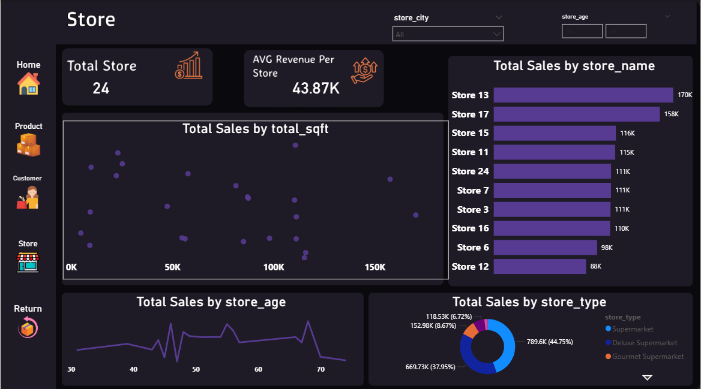

# Retail_sales analysis

Welcome to my Data Analysis and Power BI portfolio.

## Projects

### Retail_sales Analysis Dashboard
This project analyzes sales company during two years  trends using Power BI dashboards and data visualization.

### Tools Used
- Power BI
- Excel
- SQl
- CSV Data
- Data Visualization

## Files Included
- Final project power pi.pbix
- customer_cleaned.csv
- product_cleaned.csv
- region_cleaned.csv
- return_cleaned.csv
- sales2018_cleaned.csv
- sales2017_cleaned.csv
  

## Dashboard Preview

